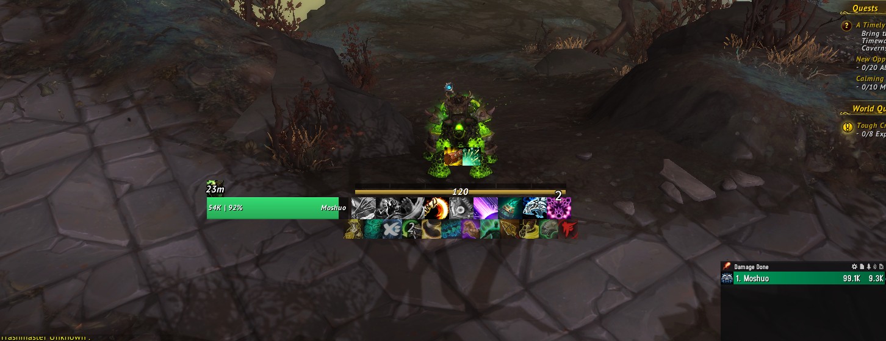
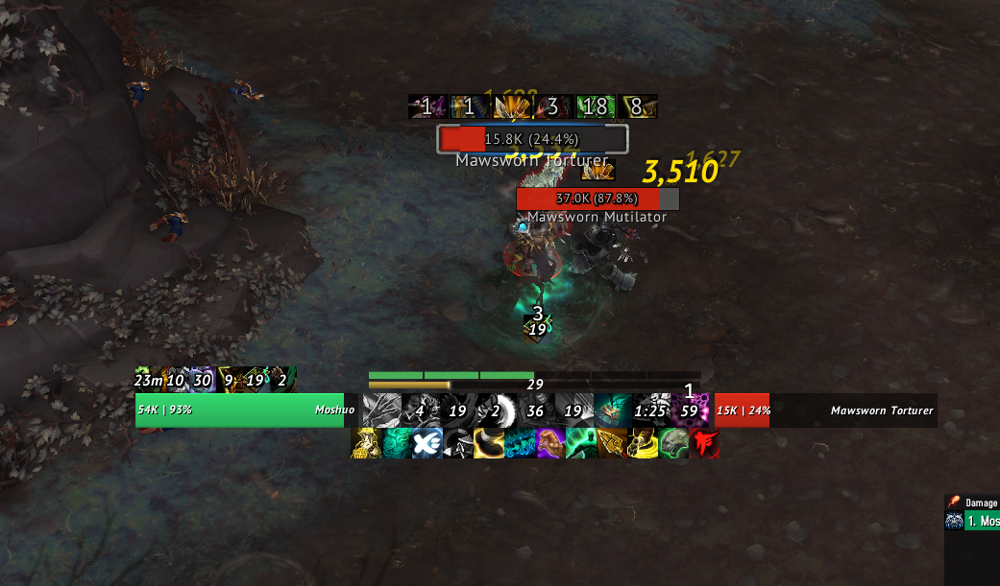

# Jae UI

## My custom user interface in World of Warcraft. 
It is very minimal is entirely built using lightweight WeakAuras.

I do also have little- and bigwigs which are both higly customized.

I will also use glass to make my chat look cool when it starts working in this expansion.

Windwalker
------

Minimal dynamic mistweaver UI which tracks all important buffs, defensives, & cooldowns etc.

Mistweaver
------

Minimal dynamic windwalker UI which tracks all important buffs, procs, defensives, & cooldowns etc.

The general UI
------

The health bar and target frame etc is also a part of this UI, which is seperate from the other class specific UI elements.

* [General UI](https://wago.io/yGcebkJoo)
* [Monk](https://wago.io/L8y468DTr)
